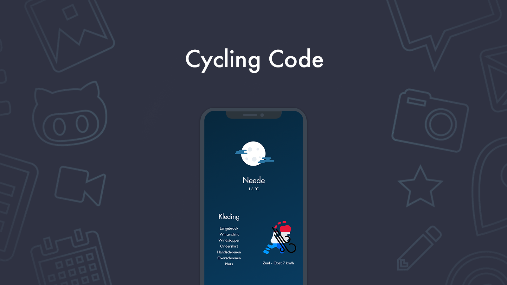

# CyclingCode
Cycling Code is just a simple React-Native application with an API connection with Weatherbit.
This app gives the rider information about the weather, and what to wear. It also shows the wind direction.

## Roadmap
I still want to add some things, like is it going to rain. And how bad is the weather upcoming 2 hours?
Also I want to add some self learning protocol, where the user gives feedback on the chosen clothing.

